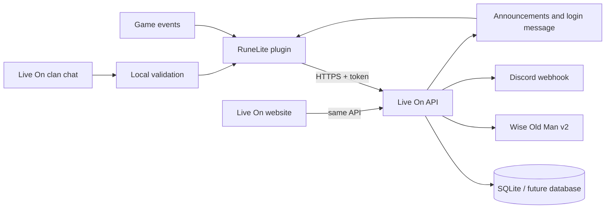

# Architecture

[English](architecture.md) | [Brazilian Portuguese](architecture.pt-BR.md)

## Core rule

RuneLite captures events only for the local character. Data consolidation,
staff permissions, Wise Old Man access and Discord delivery remain in the
backend. This prevents secrets from being distributed and lets the website
consume the same data source as the plugin.

## RuneLite client

- `LiveOnPlugin`: registers components and forwards events.
- `ClanAccessManager`: reads the local RuneLite session and requests access.
- `LiveOnApiClient`: the only component that knows URLs, JSON and HTTP headers.
- `events/*`: turns events into small data objects; it does not render UI.
- `AnnouncementService`: polls announcements outside the client thread.
- `ui/*`: renders objects received from the API.

## Backend

- `main.py`: routes and authorization rules.
- `database.py`: isolated SQL and persistence.
- `wom.py`: Wise Old Man API caching and adaptation.
- `discord.py`: Discord embed formatting.
- `security.py`: access-code hashing and temporary HMAC tokens.

SQLite supports the first project phase. A PostgreSQL implementation should
retain the same public `Database` methods so the plugin remains unchanged.
